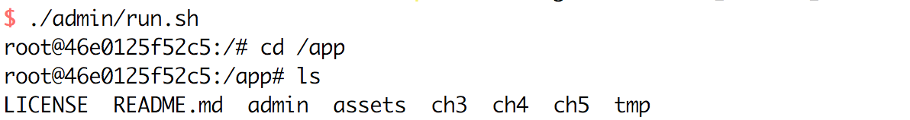

<p align="center">
  <b>快速购书<a href="https://item.jd.com/12479014.html" target="_blank">链接</a></b><br>
  <a href="https://item.jd.com/12479014.html" target="_blank">
        
  </a>
</p>


## 精彩书评

```
本书不是简单的罗列算法，而是指向了如何让计算机处理语言这样一个有挑战性的话题，以最终构造一个问答系统为目标，充满了好奇和实践精神，是陪伴读者学习人工智能和语言处理的好书。

-- 王小川，搜狗CEO
```

```
本书介绍了近年来自然语言处理、信息检索系统和机器阅读理解的成果，带有翔实的示例，对实际应用有很好的借鉴意义，而且从原理上进行了解释，可以帮助读者掌握这些技术，是入门自然语言处理和深度学习的好书。

-- 李纪为，香侬科技CEO
```

# 《智能问答与深度学习》随书附带源码

**《智能问答与深度学习》** 这本书是服务于准备入门机器学习和自然语言处理的学生和软件工程师的，在理论上介绍了很多原理、算法，同时也提供很多示例程序增加实践性，这些程序被汇总到示例程序代码库，这些程序主要是帮助大家理解原理和算法的，欢迎大家下载和执行。代码库的地址是：

https://github.com/l11x0m7/book-of-qna-code

在阅读本书的过程中，各章有示例程序的段落会说明对应代码库的路径。同时，在代码库中，也有文档介绍如何执行程序。

## 安装依赖软件

快速执行源码的最佳实践是通过docker容器，读者需要在计算机中安装

* Git

Git是一个分布式版本管理工具，目前很多开源码项目使用它发布和协作，下载地址：

https://git-scm.com/

* Docker

Docker是容器技术，容器是一种构建、发布和执行软件服务的标准，容器能屏蔽操作系统的不一致性，简便了软件发布、开发和运维，下载地址：

https://www.docker.com/

这两个工具能兼容多种操作系统，我们强烈建议在阅读本书的第三章前，安装二者。

## 下载源码

在命令行终端，使用下面的方式下载源码：

```
git clone https://github.com/l11x0m7/book-of-qna-code.git book-of-qna-code
```

## 执行示例程序

启动容器：

```
cd book-of-qna-code
./admin/run.sh # Mac OSX, Linux, Unix
```

初次运行该脚本时，会下载docker的镜像，在这个镜像中，我们安装了示例代码执行需要的依赖环境，这一步骤可能占用半个小时或更长时间，程序执行完毕，命令行终端会自动进入容器内部，如下图：



至此，读者就具有可执行示例程序的环境了，详细使用说明参考各项目文件夹内的文档。

## 联系我们

在您遇到关于软件安装、容器运行、程序代码执行等问题时，可通过下面地址反馈给我们：

https://github.com/l11x0m7/book-of-qna-code/issues


## 第二章 机器学习基础

[马尔可夫链](ch2/markov)

[隐马尔可夫模型](ch2/hmm)

[CRF模型](ch2/crf)

## 第三章 自然语言处理基础

[有向无环图(DAG)](ch3/DAG)

[MMSEG中文分词器](ch3/mmseg)

[HMM中文分词器](ch3/hmmseg)

[依存关系分析之transition-based经典算法](ch3/dependency-parser-nivre)

[依存关系分析之transition-based神经网络算法](ch3/dependency-parser-neural)

[Apache Lucene示例程序](ch3/lucene-sample)

[Elasticsearch信息检索](ch3/search-engine)

## 第四章 深度学习初步

[lightnn：教学用神经网络工具包](ch4/lightnn/)

[Siamese神经网络完成问答任务](ch4/siamese_nn/)

[Siamese卷积神经网络完成问答任务](ch4/siamese_cnn/)

[Siamese循环神经网络完成问答任务](ch4/siamese_rnn/)

## 第五章 词向量实现及应用

该章节主要为大家介绍深度学习在自然语言处理中必不可少的部分：embedding。此处我们为大家介绍了三种比较经典的词向量模型：word2vec，glove以及fasttext。通过实现这三个模型，并在小数据集上测试，帮助大家更好的理解这三个模型的原理。

[N元模型(ngrams)](ch5/ngrams)

[word2vec的简单实现](ch5/word2vec)

[glove的简单实现](ch5/glove)

[fasttext的简单实现](ch5/fasttext)

## 第六章 社区问答中的QA匹配

该章节主要介绍社区问答中的问答匹配问题，并介绍具有代表性的几个深度匹配模型。在该章中我们给出一个简单易用的pairwise的问答匹配网络QACNN。

[Pairwise形式的QACNN模型](ch6/QACNN/)

[Decomposable Attention模型](ch6/decomposable_att_model/)：复现《A Decomposable Attention Model for Natural Language Inference》

[多比较方式的比较-集成模型](ch6/seq_match_seq/)：复现《A COMPARE-AGGREGATE MODEL FOR MATCHING TEXT SEQUENCES》

[BiMPM模型](ch6/bimpm/)：复现《Bilateral Multi-Perspective Matching for Natural Language Sentence》

## License
[Apache 2.0](./LICENSE)

[![chatoper banner][co-banner-image]][co-url]

[co-banner-image]: https://user-images.githubusercontent.com/3538629/42217321-3d5e44f6-7ef7-11e8-94e7-1574bfa1dbb8.png
[co-url]: https://www.chatopera.com
