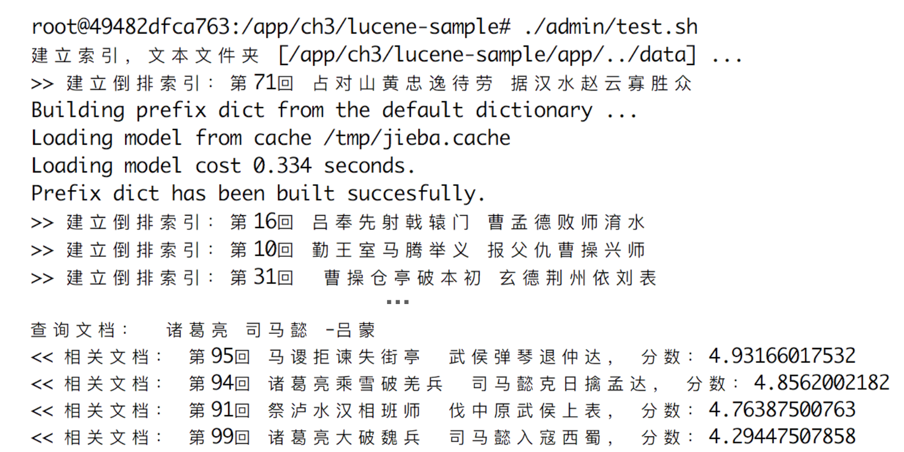

# lucene 示例程序

该程序演示了Apache Lucene项目的基本使用，实现基于 [pylucene](http://lucene.apache.org/pylucene/index.html)。

如果使用本书附带的[docker镜像](https://hub.docker.com/r/chatopera/qna-book/)，所有依赖已经安装好，不需要再次安装。使用docker镜像运行程序的方式详见[文档](https://github.com/l11x0m7/book-of-qna-code/blob/master/README.md)。

## 依赖

* python2.7
* pylucene
* jieba

```
pip install -r requirements.txt
```

## 执行程序
```
./admin/test.sh
```

该脚本会建立[《三国演义》](./data)的倒排索引，并进行一次查询，详细查看 ```app/three_kingdoms_lucene.py```。

