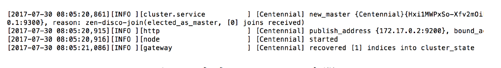

# Elasticsearch
Elasticsearch 信息检索系统

如果使用本书附带的[docker镜像](https://hub.docker.com/r/chatopera/qna-book/)，所有依赖已经安装好，不需要再次安装。使用docker镜像运行程序的方式详见[文档](https://github.com/l11x0m7/book-of-qna-code/blob/master/README.md)。

## 依赖

* Java 8+
* Elasticsearch 2.4.x
* Elasticsearch head 插件
* Elasticsearch jieba分词插件


## 启动服务

```
./admin/start.sh
```

服务正常启动后，可看到类似的日志：



## 访问服务
参考 《智能问答与深度学习》的第三章中Elasticsearch相关内容。