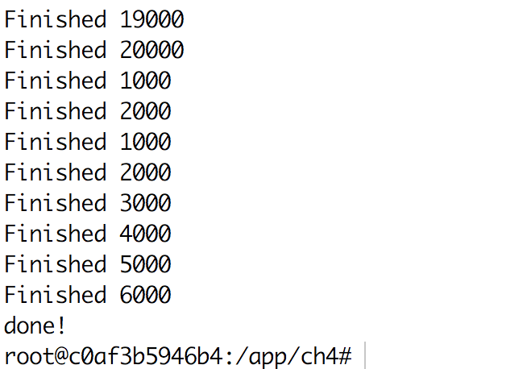

# Siamese神经网络完成问答任务

基于[Tensorflow](https://www.tensorflow.org/)和[WikiQA数据集](https://aclweb.org/anthology/D15-1237)。

利用全连接层实现的一个pointwise的QA网络。

## 安装

如果使用本书附带的[docker镜像](https://hub.docker.com/r/chatopera/qna-book/)，所有依赖已经安装好，不需要再次安装。使用docker镜像运行程序的方式详见[文档](https://github.com/l11x0m7/book-of-qna-code/blob/master/README.md)。

### 依赖

* python2.7
* tensorflow==1.8.0


#### 下载词向量文件[glove](../download.sh)。

```
../download.sh
```

## 预处理wiki数据

```
../preprocess.sh
```

正常运行后，有下面输出：



## 运行

### 训练模型

```
./train.sh
```

### 测试模型

```
./test.sh
```

某模型测试结果
```
(venv-py2) root@c0af3b5946b4:/app/ch4/siamese_nn# ./test.sh
test model
embedding file: /tools/embedding/glove.6B.100d.txt
Pre-trained: 27058 (92.94%)
2018-06-16 08:48:31.042864: I tensorflow/core/platform/cpu_feature_guard.cc:140] Your CPU supports instructions that this TensorFlow binary was not compiled to use: AVX2 FMA
WARNING:tensorflow:From /app/ch4/siamese_nn/models.py:76: calling l2_normalize (from tensorflow.python.ops.nn_impl) with dim is deprecated and will be removed in a future version.
Instructions for updating:
dim is deprecated, use axis instead
[test] MAP:0.57962640327, MRR:0.595034754835
```
